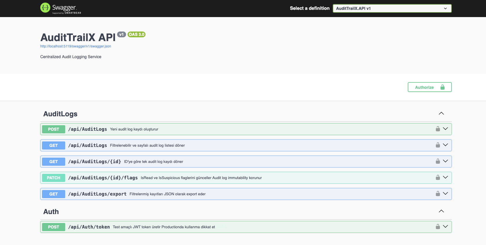
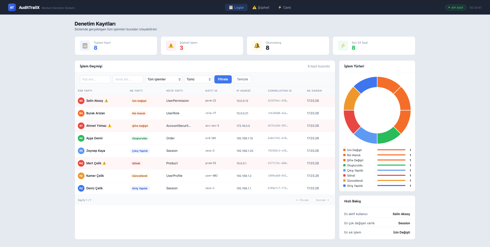
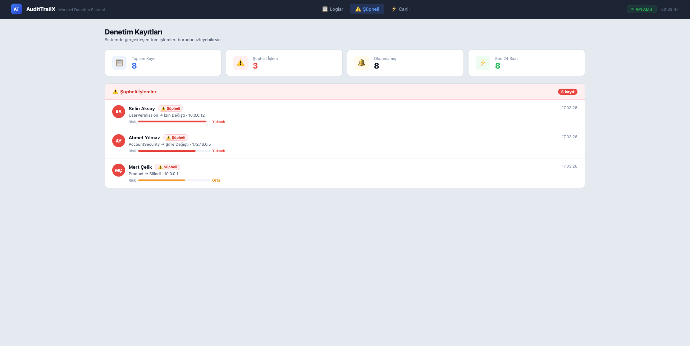
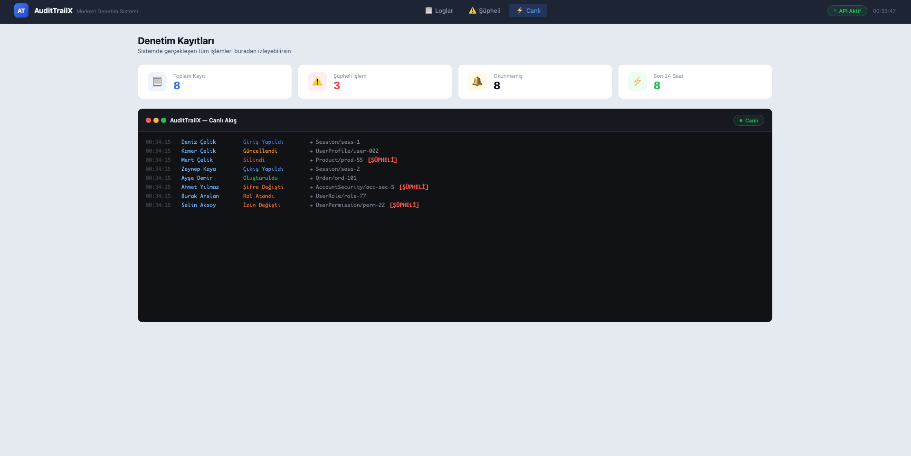
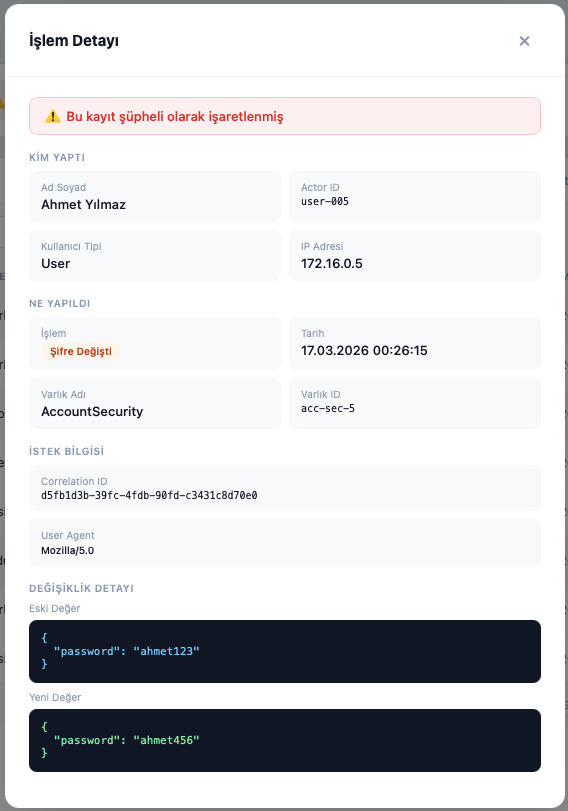

# AuditTrailX

<p align="center">
  <a href="#english">🇬🇧 English</a> | <a href="#turkish">🇹🇷 Türkçe</a>
</p>

---

<h2 id="english">🇬🇧 English</h2>

> A centralized audit logging service that answers **who did what, when, and what changed** in enterprise applications.

---

## Why AuditTrailX?

In most projects, data changes happen but tracking them afterward becomes difficult. AuditTrailX solves this:

- ✅ Who made the change?
- ✅ When did it happen?
- ✅ What was the old value? What is the new one?
- ✅ Which IP address and request did it come from?

---

## Architecture

```
AuditTrailX.API      → Controllers, Middleware, DI, Auth
AuditTrailX.Service  → Business logic, mapping
AuditTrailX.Data     → EF Core, Repository, Configurations, Migrations
AuditTrailX.Core     → Entities, DTOs, Interfaces, Enums
```

### Project Structure

```
AuditTrailX/
├── AuditTrailX.API/
│   ├── Controllers/
│   ├── Extensions/
│   └── Middleware/
├── AuditTrailX.Core/
│   ├── Common/
│   ├── DTOs/
│   ├── Entities/
│   ├── Enums/
│   └── Interfaces/
├── AuditTrailX.Data/
│   ├── Configurations/
│   ├── Context/
│   ├── Migrations/
│   └── Repositories/
├── AuditTrailX.Service/
│   └── Services/
├── AuditTrailX.Tests/
└── AuditTrailX.Web/
    ├── index.html
    └── screenshots/
```

---

## Tech Stack

| Layer | Technology |
|---|---|
| Backend | .NET 8 / ASP.NET Core Web API |
| Database | PostgreSQL + EF Core 8 |
| Architecture | Clean Architecture |
| Auth | JWT Bearer Authentication |
| Documentation | Swagger UI |
| Testing | xUnit + Moq + FluentAssertions |

---

## Features

- 🔐 JWT-protected endpoints
- 📝 Audit log creation
- 🔍 Filterable and paginated listing (actor, entity, date, action type)
- 🚩 Flag management (`IsRead`, `IsSuspicious`)
- 📤 JSON export support
- ⚡ Global exception middleware
- 🔗 Correlation ID middleware
- 🧪 Unit tests (service layer)
- 🌱 Seed data support

---

## Setup

```bash
git clone https://github.com/Deniz-Kmr/AuditTrailX.git
cd AuditTrailX
```

Create `appsettings.Development.json`:

```json
{
  "ConnectionStrings": {
    "DefaultConnection": "Host=localhost;Port=5432;Database=YOUR_DATABASE_NAME;Username=YOUR_USERNAME;Password=YOUR_PASSWORD"
  },
  "JwtSettings": {
    "SecretKey": "YOUR-SECRET-KEY-MIN-32-CHARACTERS-LONG",
    "Issuer": "AuditTrailX",
    "Audience": "AuditTrailX.Client",
    "ExpirationMinutes": 60
  }
}
```

Run migrations and start the app:

```bash
cd AuditTrailX.API
dotnet ef database update --project ../AuditTrailX.Data --startup-project .
dotnet run
```

Run tests:

```bash
dotnet test
```

Swagger UI: `http://localhost:{PORT}/swagger`

---

## Endpoints

| Method | Endpoint | Description |
|---|---|---|
| POST | /api/auth/token | Get JWT token |
| POST | /api/auditlogs | Create new log |
| GET | /api/auditlogs | Filtered and paginated list |
| GET | /api/auditlogs/{id} | Single log detail |
| PATCH | /api/auditlogs/{id}/flags | Update IsRead / IsSuspicious |
| GET | /api/auditlogs/export | JSON export |

---

## Example Requests

Get token:

```bash
curl -X POST http://localhost:{PORT}/api/auth/token \
  -H "Content-Type: application/json" \
  -d '{"username":"deniz","password":"deniz1234"}'
```

Create log:

```bash
curl -X POST http://localhost:{PORT}/api/auditlogs \
  -H "Authorization: Bearer {TOKEN}" \
  -H "Content-Type: application/json" \
  -d '{
    "actorId": "user-1",
    "actorName": "Deniz Celik",
    "actorType": 1,
    "actionType": 2,
    "entityName": "UserProfile",
    "entityId": "user-1",
    "oldValues": "{\"email\":\"old@mail.com\"}",
    "newValues": "{\"email\":\"new@mail.com\"}"
  }'
```

---

## Web Dashboard

Run the dashboard while the API is running:

```bash
cd AuditTrailX.Web
python3 -m http.server 3000
```

Open `http://localhost:3000` in your browser.

**Dashboard Features:**
- 📋 **Logs** — filterable and paginated log history with detail modal on click
- ⚠️ **Suspicious** — suspicious logs with risk scoring
- ⚡ **Live** — terminal-style real-time log stream
- 🔍 **Detail modal** — old/new values in JSON format, correlation ID, user agent

---

## Screenshots

**Swagger UI — API Documentation**


**Logs — Log history, filtering and chart**


**Suspicious — Risk-scored suspicious logs**


**Live — Terminal-style real-time stream**


**Detail Modal — Suspicious log with old/new value comparison**


---

<h2 id="turkish">🇹🇷 Türkçe</h2>

> Kurumsal uygulamalarda **kim ne yaptı, ne zaman yaptı, ne değişti** sorularını merkezi bir yerde yanıtlayan audit logging servisi.

---

## Neden AuditTrailX?

Çoğu projede veri değişiklikleri gerçekleşir ama sonradan izlemek zorlaşır. AuditTrailX bu problemi çözer:

- ✅ Değişikliği kim yaptı?
- ✅ Ne zaman yaptı?
- ✅ Eski değer neydi, yeni değer ne oldu?
- ✅ Hangi IP'den, hangi istekten geldi?

---

## Mimari

```
AuditTrailX.API      → Controller, Middleware, DI, Auth
AuditTrailX.Service  → Business logic, mapping
AuditTrailX.Data     → EF Core, Repository, Configurations, Migrations
AuditTrailX.Core     → Entities, DTOs, Interfaces, Enums
```

### Proje Yapısı

```
AuditTrailX/
├── AuditTrailX.API/
│   ├── Controllers/
│   ├── Extensions/
│   └── Middleware/
├── AuditTrailX.Core/
│   ├── Common/
│   ├── DTOs/
│   ├── Entities/
│   ├── Enums/
│   └── Interfaces/
├── AuditTrailX.Data/
│   ├── Configurations/
│   ├── Context/
│   ├── Migrations/
│   └── Repositories/
├── AuditTrailX.Service/
│   └── Services/
├── AuditTrailX.Tests/
└── AuditTrailX.Web/
    ├── index.html
    └── screenshots/
```

---

## Tech Stack

| Katman | Teknoloji |
|---|---|
| Backend | .NET 8 / ASP.NET Core Web API |
| Veritabanı | PostgreSQL + EF Core 8 |
| Mimari | Clean Architecture |
| Auth | JWT Bearer Authentication |
| Dökümantasyon | Swagger UI |
| Test | xUnit + Moq + FluentAssertions |

---

## Özellikler

- 🔐 JWT ile korunan endpoint yapısı
- 📝 Audit log oluşturma
- 🔍 Filtrelenebilir ve sayfalı listeleme (actor, entity, tarih, aksiyon tipi)
- 🚩 Flag yönetimi (`IsRead`, `IsSuspicious`)
- 📤 JSON export desteği
- ⚡ Global exception middleware
- 🔗 Correlation ID middleware
- 🧪 Unit testler (service katmanı)
- 🌱 Seed data desteği

---

## Kurulum

```bash
git clone https://github.com/Deniz-Kmr/AuditTrailX.git
cd AuditTrailX
```

`appsettings.Development.json` oluştur:

```json
{
  "ConnectionStrings": {
    "DefaultConnection": "Host=localhost;Port=5432;Database=YOUR_DATABASE_NAME;Username=YOUR_USERNAME;Password=YOUR_PASSWORD"
  },
  "JwtSettings": {
    "SecretKey": "YOUR-SECRET-KEY-MIN-32-CHARACTERS-LONG",
    "Issuer": "AuditTrailX",
    "Audience": "AuditTrailX.Client",
    "ExpirationMinutes": 60
  }
}
```

Migration ve veritabanını güncelle:

```bash
cd AuditTrailX.API
dotnet ef database update --project ../AuditTrailX.Data --startup-project .
dotnet run
```

Testleri çalıştır:

```bash
dotnet test
```

Swagger UI: `http://localhost:{PORT}/swagger`

---

## Endpoint'ler

| Method | Endpoint | Açıklama |
|---|---|---|
| POST | /api/auth/token | JWT token al |
| POST | /api/auditlogs | Yeni log oluştur |
| GET | /api/auditlogs | Filtreli ve sayfalı liste |
| GET | /api/auditlogs/{id} | Tek kayıt detayı |
| PATCH | /api/auditlogs/{id}/flags | IsRead / IsSuspicious güncelle |
| GET | /api/auditlogs/export | JSON export |

---

## Örnek İstek

Token al:

```bash
curl -X POST http://localhost:{PORT}/api/auth/token \
  -H "Content-Type: application/json" \
  -d '{"username":"deniz","password":"deniz1234"}'
```

Log oluştur:

```bash
curl -X POST http://localhost:{PORT}/api/auditlogs \
  -H "Authorization: Bearer {TOKEN}" \
  -H "Content-Type: application/json" \
  -d '{
    "actorId": "user-1",
    "actorName": "Deniz Çelik",
    "actorType": 1,
    "actionType": 2,
    "entityName": "UserProfile",
    "entityId": "user-1",
    "oldValues": "{\"email\":\"eski@mail.com\"}",
    "newValues": "{\"email\":\"yeni@mail.com\"}"
  }'
```

---

## Web Dashboard

API çalışırken tarayıcıdan tüm audit logları görsel olarak izleyebilirsin.

```bash
cd AuditTrailX.Web
python3 -m http.server 3000
```

Tarayıcıda `http://localhost:3000` adresine git.

**Dashboard Özellikleri:**
- 📋 **Loglar** — filtrelenebilir ve sayfalı işlem geçmişi, satıra tıklayınca detay
- ⚠️ **Şüpheli** — risk skorlu şüpheli kayıtlar
- ⚡ **Canlı** — terminal ekranı, yeni kayıtlar gerçek zamanlı görünür
- 🔍 **Detay modalı** — eski/yeni değerler JSON formatında